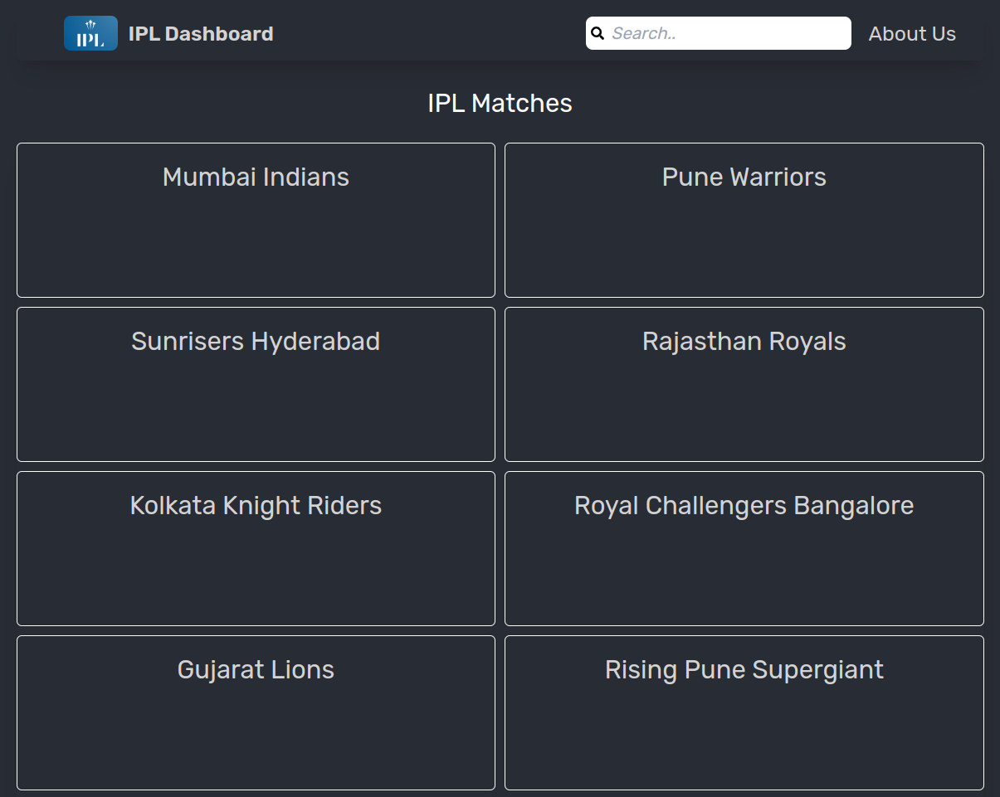
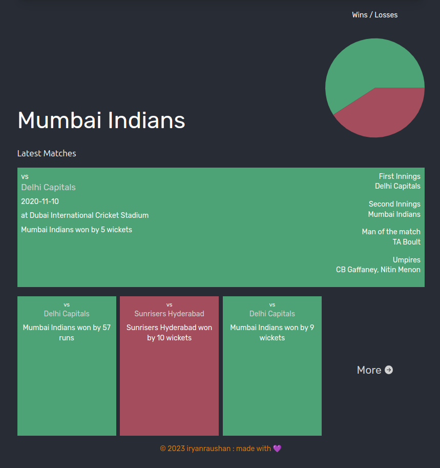
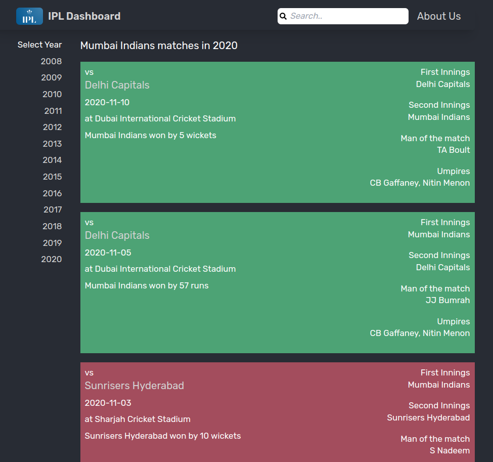

# IPLDATA

## About this project :

The ultimate website for IPL fans
and cricket enthusiasts. IPL Dashboard is a website that
provides you with the most comprehensive and interactive
source of IPL match data[2008-2020]. Whether you are a
casual fan or a hardcore cricket lover, you will find
some thing useful and interesting on this website. On IPL
Dashboard, you can access and analyze match data,
statistics, and insights from all the seasons of IPL. You
can explore various aspects of the matches, such as the
teams, players, venues, tosses, scores, outcomes, and more.

## Technology Used

-   Frontend : HTML, CSS, Reactjs, Tailwind CSS
-   Backend : Spring Boot
-   DataBase : HSQLDB
-   Tools : npm, yarn
-   Editor : vscode

## Preview

./Preview/preview.mp4

## ScreenShots

# Deployment :

`target/ipldata-0.0.1-SNAPSHOT.jar`

jar file is ready to deploy...

